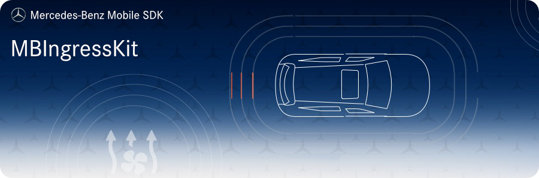

<!-- SPDX-License-Identifier: MIT -->




## Requirements
* __Minimum Android SDK:__ MBIngressKit requires a minimum API level of 23.
* __Compile Android SDK:__ MBIngressKit requires you to compile against minimum API level 30.

## Intended Usage

MBIngressKit provides you with services and functions related to users and user authentication.

### Initialization
If you use `MBMobileSDK`, it will take care of these calls internally. The following only applies if you use MBIngressKit in isolation.

The initialization requires the application context and a previous initialization of `MBNetworkKit`.
The minimal setup needs 3 important string values:
1. `USER_URL` - the base url pointing to user related REST APIs
2. `STAGE` - either "int" or "prod", depending on your stage
3. `ALIAS` - the alias used for crypto operations using the `KeyStore` API
```kotlin
MBIngressKit.init(
    IngressServiceConfig.Builder(
        appContext,
        USER_URL,
        STAGE,
        ALIAS,
        MBNetworkKit.headerService(),
        listOf(
            AuthenticationConfiguration(AuthenticationType.KEYCLOAK, "<KEYCLOAK_CLIENT_ID>"),
            AuthenticationConfiguration(AuthenticationType.CIAM, "<CIAM_CLIENT_ID>")
        )
    ).apply {
        // If using the Single-SignOn feature:
        enableSso("my_shared_user_id")
        // device identifier
        useDeviceId("my_device_id")
    }.build()
)
```

## Installation

Add the following maven url to your project `build.gradle`:
```gradle
allprojects {
    repositories {
        google()
        jcenter()
        maven {
            url 'https://pkgs.dev.azure.com/daimler-ris/sdk/_packaging/release/maven/v1'
        }
    }
}
```

Add to your app's `build.gradle`:
```gradle
implementation "com.daimler.mm:MBIngressKit:$mb_ingress_kit_version"
```