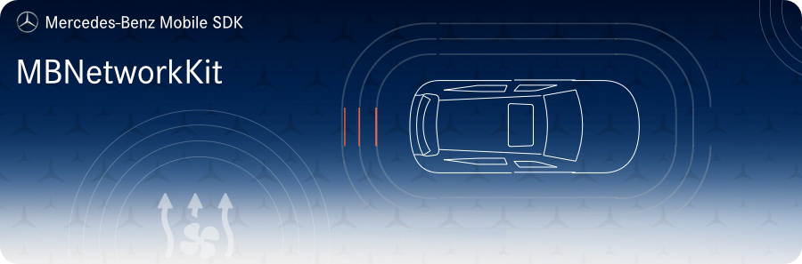

<!-- SPDX-License-Identifier: MIT -->




## Requirements
* __Minimum Android SDK:__ MBNetworkKit requires a minimum API level of 23.
* __Compile Android SDK:__ MBNetworkKit requires you to compile against minimum API level 30.

## Intended Usage

This module contains basic and utility implementations for network requests using `Retrofit` and for socket connections
using `OkHttp`.

## Initialization
If you use `MBMobileSDK`, it will take care of these calls internally. The following only applies if you use MBNetworkKit in isolation.

Initialize the NetworkKit by calling its `init` method:
```kotlin
MBNetworkKit.init(
    NetworkServiceConfig.Builder(
        "myAppIdentifier",
        "1.0",
        "<mobileSdkVersion>"
    ).apply {
        useAuthMode(AuthenticationType.CIAM.authMode)
        useSessionId(UUID.randomUUID().toString())
    }.build()
)
```

After initialization you can access the created HeaderService via `MBNetworkKit.headerService()`.

## Installation

Add the following maven url to your project `build.gradle`:
```gradle
allprojects {
    repositories {
        google()
        jcenter()
        maven {
            url 'https://pkgs.dev.azure.com/daimler-ris/sdk/_packaging/release/maven/v1'
        }
    }
}
```

Add to your app's `build.gradle`:
```gradle
implementation "com.daimler.mm:MBNetworkKit:$mb_network_kit_version"
```