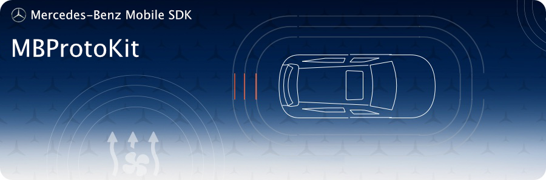

<!-- SPDX-License-Identifier: MIT -->

## Requirements
* __Minimum Android SDK:__ MBProtoKit requires a minimum API level of 23.
* __Compile Android SDK:__ MBProtoKit requires you to compile against minimum API level 30.

This module encapsulates the mappings for the proto communication with the backends. It should not be used separately.